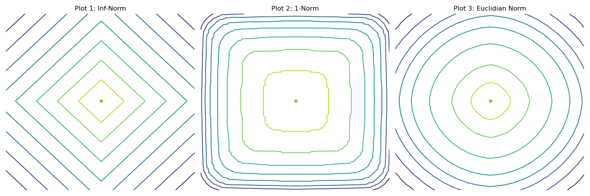
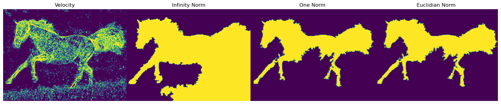
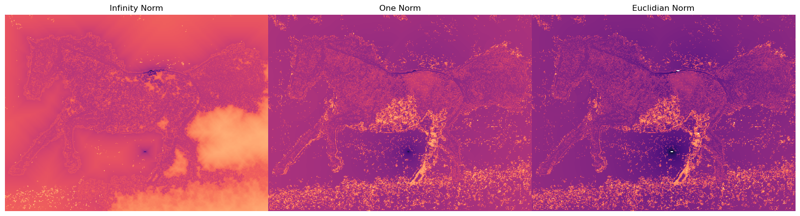
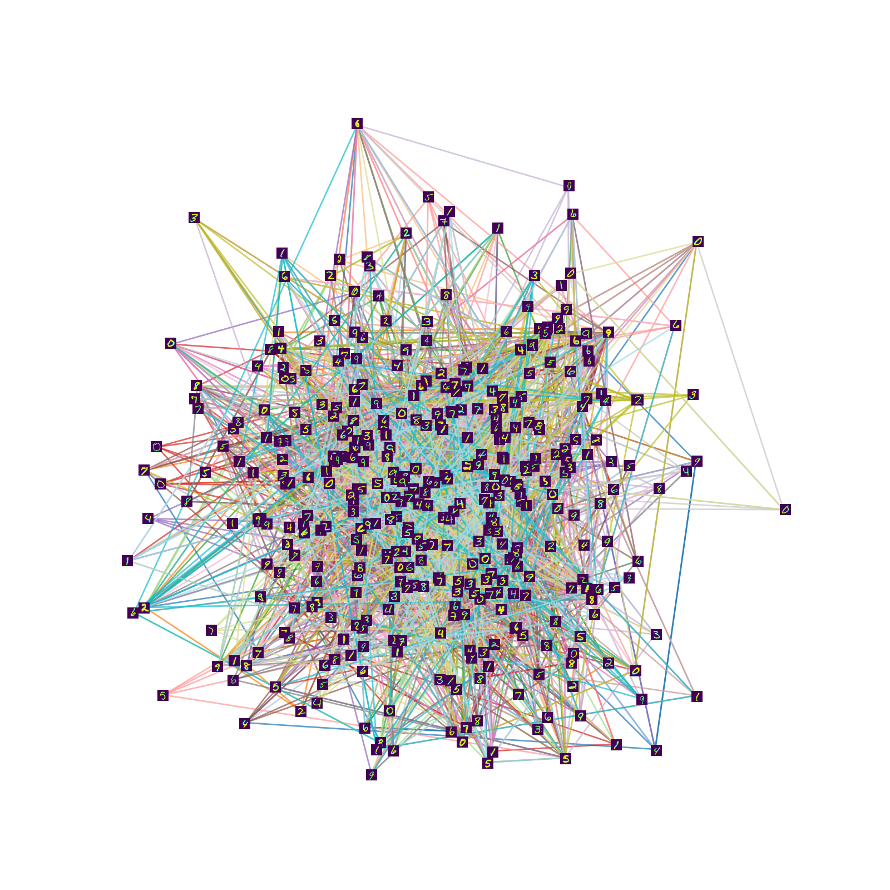
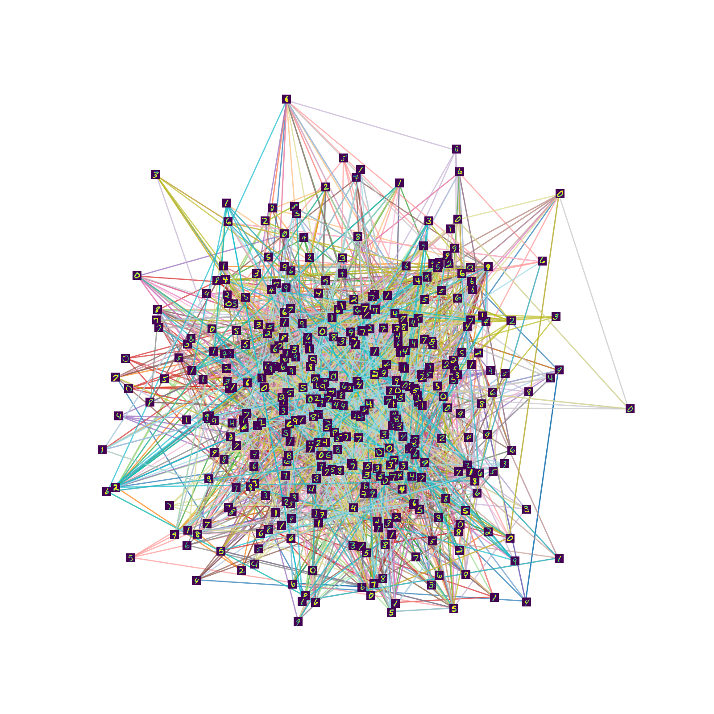
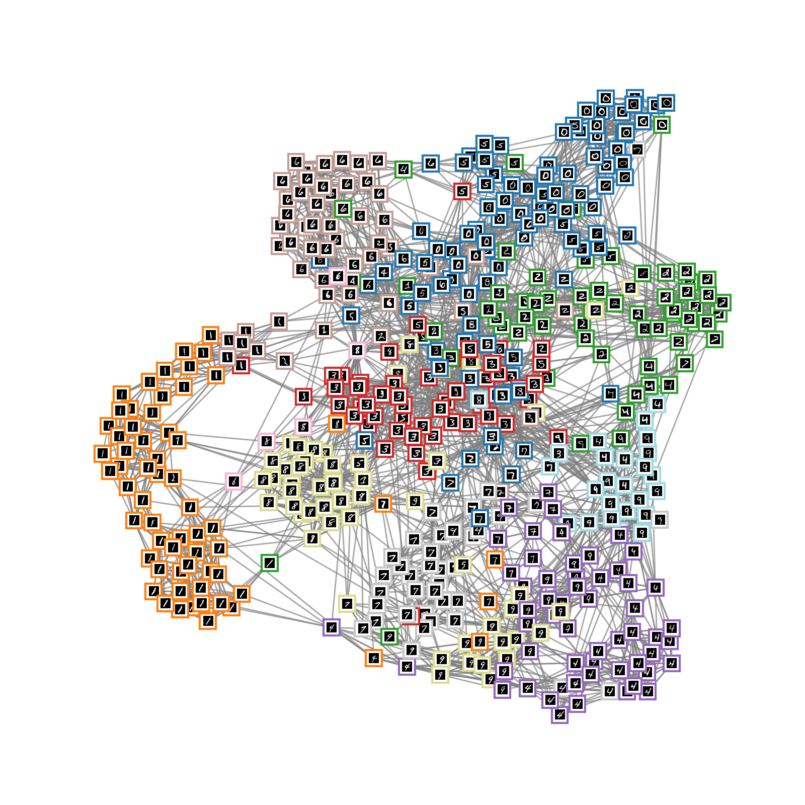

# Fast Marching for Solving Eikonal Equation on Graphs

This repository contains an implementation of the **Fast Marching Algorithm (FMA)**  for solving the Eikonal equations on *weighted graphs*. The algorithm leverages a **binary min-heap** data structure for sorting, deleteing and inserting narrow band nodes to accelerate multiple wavefront propagations, ensuring optimal performance in terms of computational complexity.

## Algorithm Overview

The **Fast Marching Algorithm** is a numerical method designed to efficiently solve the Eikonal equation, which arises from the *Hamilton-Jacobi equation*:

$$
H(x, f, \nabla f) = 0 , \qquad x \in \Omega \subset \mathbb{R}^m, \qquad f(x) = \psi(x), \qquad x \in \Gamma \subset \Omega \tag{1}
$$

where the Hamiltonian has the specific form:

$$
H(x, f, \nabla f) = \| \nabla f(x) \|_p - P(x) \tag{2}
$$

Using finite difference discretization for the gradient on a weighted graph \( G = (V, E, \omega) \), this repository provides an implementation of the discrete version:

$$
\| \nabla f(x) \|_p = P(x) \tag{3}
$$

for three different norms \( p \in \{1, 2, \infty\} \). For the infinity norm, equation (3) simplifies to a straightforward **Dijkstra shortest path algorithm**. The following figure illustrates the front propagation on rectangular 2D grid with unit speed, i.e. $\mathcal{F}(x) = 1$ for all $x \in \Omega$ and visualizes the level set propagation on a 2D grid using $L^1$, $L^\infty$, and Euclidean ($L^2$) norms. We recommend exploring the `/Jupyter_Notebook` folder for specific forms of equation $(3)$ which demonstrate how Fast Marching Library’s adopts to applications specific tasks like tracking, labeling, and distance computation.




### Key Features

1. **Multiple Source Nodes**: The implementation computes shortest paths (or distances) from *multiple* source nodes on a graph to all other nodes.  
2. **Versatile Data Handling**: By adapting geometric diffusion processes to graph structures using sparse adjacency matrices, the code can handle both local and non-local data processing tasks.  
3. **Support for Weighted Graphs**: It works on weighted graphs, making it applicable to a wide range of applications.
4. **Binary Heap Acceleration**: To optimize performance, we use a **binary min heap** datastructure for storing nodes within the *narrow band* to maintain and update the active front of the wave propagation. The binary heap helps manage the node processing order in a way similar to Dijkstra's algorithm, ensuring that nodes are processed in order of increasing distance (or cost). This ensures:
  
    - retrieving the next node with the smallest distance (or time) is done in **O(log N)** time, where **N** is the number of nodes in the heap and 
    
    - When a node's distance is updated, the heap is efficiently re-ordered, minimizing the computational cost of maintaining the wavefront. This makes the algorithm highly scalable, even for large graphs and datasets.

### Algorithm Parameters

In order to run the algorithms the following input which is dependent on the specific problem scenario at hand: 

- Adjucency Matrix in sparse format with weights encoding the similarity of neighbouring nodes. The following sparse adjucency relations are implemented 
- Five point Laplacian stencil discretizations for 2D front propagations
- Uniform sparse $(N_x\times N_y)$ and $(N_x\times N_y \times N_z)$ window adjacencies for 2D and 3D grid graph disretization
- Nonuniform adjacence matrices based on pixel wise similarities and nonuniform nonlocal adjucencies based on patch-wise similarities.   
- The implementation supports only undirected connected graphs, in case the underlying graph has multiple connected components use `FM_Ad_Matrix_Graph` routine within `Graph_Build.py`. 
- Potential Function $P(x) = \frac{1}{\mathcal{F}(x)}$ where $\mathcal{F}(x)$ is the speed function of the propagating front at node $x \in V$. 

## Applications
The Fast Marching Algorithm with binary heap acceleration is highly suited for a wide range of image and data processing tasks, including:

1. **Syntactic Data Processing**: Analyze complex graph structures, such as social networks, syntax trees, or molecular graphs, by efficiently computing distances or shortest paths TODO:.
2. **Centerline Detection in Tubular Structures**: Detect the centerlines of tubular objects in 2D or 3D images (e.g., blood vessels, airways) by simulating wave propagation along the vessel centerlines. # TODO:
3. **Distance Mapping**: Generate distance or geodesic maps from a source point to all other nodes in the graph, useful for image segmentation, shape analysis, or feature extraction in high-dimensional data.
4. **Data Visualization**: Building an adjacency graph from a given data set after specifying a distance function tracking the data from representative classe as seed points provides insights into  data properties and classes overlapps for accessing quality of the underlying data set. 
5. Image Labeling via multiple labelwise front propagations on grid graphs.


## Examples

This library provides example scripts and detailed usage instructions to help users apply the algorithm to their specific tasks. Introductory material is accessible through a Jupyter Notebook tutorial located in the [`examples`](./Jupiter_Notebooks) directory. The following prototypical scenarios are included:

1. **Distance Maps and Eikonal Equations**:
   - Solve Eikonal equations on weighted graphs using $L^2$, $L^1$, and $L^\infty$ norms using five stencil Laplacians by following the guideline summerized in the notebook `Eikonal_Equation_Notebook.ipynb`. 

<p align="center">
  <table>
    <tr>
      <td align="center"></td>
      <td align="center"></td>
      <td align="center"></td>
    </tr>
    <tr>
      <td align="center">Euclidean Norm</td>
      <td align="center">L1 Norm</td>
      <td align="center">L∞ Norm</td>
    </tr>
  </table>
</p>

2. **Image Labeling**:
  
Notebook `Eikonal_Equation_Image_Labeling.ipynb` demonstrates toy labeling workflow using Fast marching frontz propagation on example of the [Horse dataset](https://paperswithcode.com/dataset/horse-10) using covariance descriptors and deep features for computing front speeds. To label an image, it is necessary to provide information about the speed of each propagating labeling front. Below are three examples with two propagating fronts corresponding to the horse and the background, respectively.

<p align="center">
  <table>
    <tr>
      <td align="center"></td>
      <td align="center"></td>
      <td align="center"></td>
    </tr>
    <tr>
      <td align="center">L∞ Norm</td>
      <td align="center">L1 Norm</td>
      <td align="center">L2 Norm</td>
    </tr>
  </table>
</p>

- The first image in the row displays the feature map generated using **Geometric Covariance Descriptors**. 
- The next three images illustrate the final labelings based on the propagation of fronts using three different norms: **Infinity Norm ($L^\infty$)**, **One Norm ($L^1$)** and the **Euclidean Norm ($L^2$)** 



The next figure depicits the heatmaps corresponding to front propagations, offering insight into the intensity and spread of the computed distances:

 **Heatmap with Seeds in the Horse and the Background **:
   - This visualization shows how the front propagates from a seed placed inside the horse and a seed placed in the background region. 
   - The heatmap intensity reflects the speed of front propagation, which varies based on local feature properties. The propagation dynamics shift based on two seed points each with different speeds from starting location illustrates how labeling adapts to the underlying image strudture.



- Features adjacency graph weights using two classes of local features:
     - **Geometric Covariance Descriptor**
     - **Deep Features with a small field of view**, both validated in real-world applications, particularly in [medical imaging](https://dl.acm.org/doi/abs/10.1007/s11263-021-01520-5).

1. **Dataset Visualization and Clustering**:

Notebook `Eikonal_Equation_Dataset_Visualization.ipynb` demonstrates dataset visualization by clustering the MNIST dataset of 60,000 handwritten digit images. Before running the notebook download and extract the [MNIST dataset](https://github.com/zalandoresearch/fashion-mnist/tree/master/data/fashion) into `data/Mnist/` folder.

- **Graph Construction**:
  - Euclidean distance and a BallTree structure are used for efficient k-nearest neighbors (k-NN) graph assembly.
  - See Figure **Mnist_KNN_Graph** for a visualization of a 10-nearest neighbors graph.

- **Fast Marching Requirements**:
  - The adjacency graph must be symmetric and fully connected, with only one connected component. This is achieved using the `FM_Ad_Matrix_Graph` function in `Graph_Build.py`.

<p align="center">
  <table>
    <tr>
      <td align="center"></td>
    </tr>
    <tr>
      <td align="center">Nearest Neighbour Graph</td>
    </tr>
  </table>
</p>


---

## Usage of `FM_Ad_Matrix_Graph`

The `FM_Ad_Matrix_Graph` function constructs a sparse adjacency matrix from k-nearest neighbors (k-NN) graph data, ensuring that the resulting graph is symmetric and fully connected.

### Parameters
- **`Data_Vis`**: Array-like structure containing the data points.
- **`Knn_indices`**: List or array of neighbor indices for each point.
- **`Knn_distance`**: List or array of distances to the neighbors.

### Features
- Constructs a sparse adjacency matrix using k-NN indices and distances.
- Ensures symmetry by averaging the matrix with its transpose.
- If disconnected, it connects components by adding minimal-weight edges between representatives of different components.

Below are visual results showcasing single front propagation using different Eikonal norms:

<p align="center">
  <table>
    <tr>
      <td align="center"></td>
      <td align="center"></td>
      <td align="center"></td>
    </tr>
    <tr>
      <td align="center">Euclidean Distance</td>
      <td align="center">L1 Distance</td>
      <td align="center">L∞ Distance</td>
    </tr>
  </table>
</p>

Multiple front propagations provides yields provide a dataset clustering illustrated by the plot below

<p align="center">
  <table>
    <tr>
      <td align="center"></td>
      <td align="center"></td>
    </tr>
    <tr>
      <td align="center">Mnist Clustering with 10 seed points</td>
      <td align="center">Label-wise front propagation</td>
    </tr>
  </table>
</p>


##  

- Fast Sweeping Algorithm as an alternative routine for computing viscosity solution to the eikonal equation. 
- Adaption of the code to the level set formulation for segmenting object boundaries by level sets method.  

### Installation Steps
1. **Clone the Repository**:
   If you haven’t already, clone the project repository:
   ```bash
   git clone <repository-url>
   cd <repository-directory>
   ```

2. **Navigate to the `src/` Directory**:
   Move to the source directory where the `Makefile` is located:
   ```bash
   cd src/
   ```

3. **Run the Build Command**:
   Build the project using the following command:
   ```bash
   make all
   ```
   This command compiles the source files and prepares the project for execution.
   
---

#### Cleaning the Build
To clean up compiled files and reset the build environment, use:
```bash
make clean
```

This ensures a clean workspace for rebuilding if needed.


## Citation
The code of this repository implements the ideas of Eikonal equations on graphs proposed in the following papers:

**X. Desquesnes, A. Elmoataz, O. Lézoray, "Eikonal Equation Adaptation on Weighted Graphs: Fast Geometric Diffusion Process for Local and Non-local Image and Data Processing," Journal of Mathematical Imaging and Vision, vol. 46, pp. 238-257, 2012.**  
[Semantic Scholar Link](https://api.semanticscholar.org/CorpusID:8983940)

**Sethian, J. A. "Fast Marching Methods" SIAM Review, vol. 41, pp. 199-235, 1999.**  
[Semantic Scholar Link](https://epubs.siam.org/doi/10.1137/S0036144598347059)

